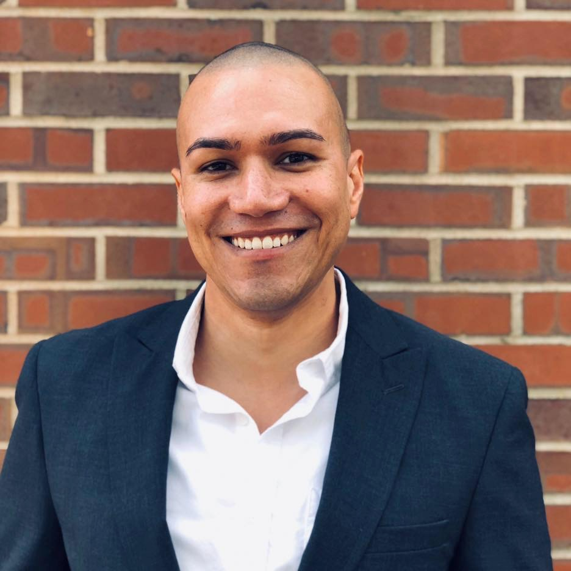

	

		
	

	

		<h1>Marlan McInnes-Taylor</h1>
		
Department of Computer Science 
			The University of Texas at Austin 
			2317 Speedway 
			Austin, TX 78712 
		

		

			<strong>Contact:</strong>&puncsp;<a href="mailto:marlan@cs.utexas.edu">marlan@cs.utexas.edu</a>
			 
			<strong>CV:</strong>&puncsp;<a
				href="{{ site.url }}/assets/files/mmcinnestaylor_cv.pdf"
				target="_blank" title="Curriculum Vitae">View</a>&puncsp;<small>[<a
				href="{{ site.url }}/assets/files/mmcinnestaylor_cv.pdf"
				target="_blank" title="Curriculum Vitae" download>Download</a>]</small>
			 
			<a href="https://www.linkedin.com/in/mmcinnestaylor" target="_blank" rel="external"
				title="Linkedin"><i class="fa fa-linkedin fa-lg social-icon"></i></a>
			&puncsp;
			<a href="https://github.com/mmcinnestaylor" target="_blank" rel="external" title="GitHub"><i
					class="fab fa-github fa-lg social-icon"></i></a>
			&puncsp;
			<a href="https://scholar.google.com/citations?user=zOXxor8AAAAJ" target="_blank" rel="external"
				title="Google Scholar"><i class="ai ai-google-scholar ai-lg social-icon"></i></a>
			&puncsp;
			<a href="https://twitter.com/mmcinnestaylor" target="_blank" rel="external" title="Twitter"><i
					class="fab fa-twitter fa-lg social-icon"></i></a>
		

	

<h3>Background</h3>

I am currently an M.S. Candidate in <a href="https://www.cs.utexas.edu/" target="_blank" rel="external">Computer
		Science</a> at <a href="https://www.utexas.edu/" target="_blank" rel="external">The University of Texas at
		Austin</a>. I received B.S. degrees in <a href="https://www.cs.fsu.edu/" target="_blank" rel="external">Computer
		Science</a> and <a href="https://www.math.fsu.edu/" target="_blank" rel="external">Applied Mathematics</a> from
	<a href="https://www.fsu.edu/" target="_blank" rel="external">Florida State University</a> in 2021, and a B.A. in <a
		href="https://phil.ufl.edu/" target="_blank" rel="external">Philosophy</a> from the <a
		href="https://www.ufl.edu/" target="_blank" rel="external">University of Florida</a> in 2009.

My research interests lie in Artificial Intelligence and Neuroscience. I am particularly interested in developing and
	improving computational models of human cognitive processes, with the goal of creating more explainable and generalizeable
	biologically inspired AI algorithms and techniques.

<h3>Research</h3>
<ul>
	<li>
		<strong>Undergraduate Research Assistant</strong>
		<ul>
			<li>Florida State University USER Lab</li>
			<li>January 2020 - April 2021</li>
			<li>Supervisor: Dr. Chris Mills</li>
			<li>Topic: Automating Software Traceability Link Recovery utilizing Word Embeddings within a Shallow Neural
				Network</li>
		</ul>
	</li>
	<li>
		<strong>Honors in the Major Program</strong>
		<ul>
			<li>Undergraduate Thesis</li>
			<li>August 2019 - May 2020</li>
			<li>Supervisors: Dr. Sonia Haiduc, Ms. Sharanya Jayaraman</li>
			<li>Topic: Skin Cancer Detection and Classification using an Artificial Neural Network</li>
		</ul>
	</li>
</ul>

<!-- <h3>Publications</h3> -->

<h3>Projects</h3>
<ul>
	<li>
		<a href="https://fsu-acm.github.io/Programming-Contest-Suite/" target="_blank" rel="external">Programming
			Contest Suite</a>: A Django + DOMjudge web application for hosting ICPC style programming contests at
		Florida State University.
	</li>
	<ul>
		<li>Author and maintainer</li>
	</ul>
</ul>

